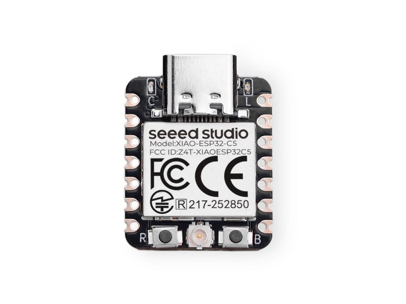

# Seeed XIAO ESP32-C5 (Sense Node Mainboard)

[中文文档](README.zh.md) | [English](README.md)

[](https://github.com/Mi-Bee-Studio/seeed-xiao-esp32c5/actions/workflows/build.yml)



A board under the board-centric repo convention. **This repo is organized with the board as root:**

```
seeed-xiao-esp32c5/
├── README.md          # this file: all hardware info for this board
└── <project>/         # one directory per project built on this board (named by capability)
    ├── CMakeLists.txt / main/ 
    └── README.md      # project description + build/flash commands
```

Key points of the convention:

- **Board directory name** = board name (kebab-case); the root README covers hardware only, never project content;
- **Each project directory builds standalone**: it ships its full build trio; `cd <project> && idf.py build` produces the firmware;
- Projects share no code; when commonality is needed, copy first, and consider extracting a shared component only once things stabilize.

### Firmware baseline norms (mandatory fleet-wide)

1. **Watchdog: mandatory.** Tasks subscribe to the ESP-IDF TWDT and feed it periodically;
2. **Web/API firmware upgrade (OTA): mandatory where the hardware allows.** dual-band WiFi and 8 MB flash fit dual OTA slots, so every project ships a web upgrade path.

| Project | Watchdog | Web/API OTA |
|---------|----------|-------------|
| blink | ✅ per-task TWDT (5 s panic) | ✅ dual OTA slots + streaming `POST /ota` |

---

## Board Overview

| Item | Value |
|------|-------|
| Chip | **ESP32-C5** — RISC-V dual-core @ 240 MHz, 384 KB SRAM / 320 KB ROM (bare chip, not a module) |
| Flash | **8 MB external** (Puya PY25Q64HA, QSPI) |
| PSRAM | Wiki states **8 MB Flash & 8 MB PSRAM** (in-package PSRAM variant; unverified in this repo — validate on real hardware before enabling `SPIRAM`) |
| Wireless | **Dual-band WiFi 6 (2.4 GHz + 5 GHz, 802.11 a/b/g/n/ac/ax)** + Bluetooth 5 (LE) |
| USB | Native USB Type-C (**USB-Serial-JTAG**: console + flashing, no bridge chip) |
| Onboard LED | **User LED = GPIO27** (single-color, silkscreen `L`) + red charge LED (silkscreen `C`) |
| Buttons | BOOT = **GPIO28** (hold at power-up for download mode), RESET = CHIP_EN |
| Antenna | External **U.FL** connector (dual-band switch Skyworks LFD182G45DCHD277) |
| Dimensions | 21 × 17.8 mm (standard XIAO form factor) |
| IDF | **v5.5+ (preview support)**; this repo builds with **v6.0** (v6.0 errata: CPU limited to 160 MHz when flash encryption is enabled) |

## Pinout Diagram (USB-C pointing up, front/component-side view; D numbers = XIAO silkscreen)

```
                 ┌─ USB-C ─┐
       5V ◎┬───┘          ├───┬◎ D0 = GPIO1  (ADC, LP_UART_DSRN)
      GND ◎│              │   ◎ D1 = GPIO0  (LP_UART_DTRN)
      3V3 ◎│  [USER LED]  │   ◎ D2 = GPIO25
     D8 ◎  │   = GPIO27   │   ◎ D3 = GPIO7  (SDIO_DATA1)
     D9 ◎  │              │   ◎ D4 = GPIO23 (I2C SDA)
    D10 ◎  │   ESP32-C5   │   ◎ D5 = GPIO24 (I2C SCL)
           │              │   ◎ D6 = GPIO11 (UART TX)
           └──────────────┘   ◎ D7 = GPIO12 (UART RX)
            left row (front)  right row (front)

  Back JTAG pads: MTDO=GPIO5 · MTDI=GPIO3 · MTCK=GPIO4 · MTMS=GPIO2
  Battery sense: ADC_BAT=GPIO6 (reading ×2.0) · enable=GPIO26
```

Key points (pin mapping per the [Seeed wiki Pin Map](https://wiki.seeedstudio.com/xiao_esp32c5_getting_started/)):

- **Left row** (downward from USB): `5V · GND · 3V3 · D8=GPIO8(SPI SCK) · D9=GPIO9(SPI MISO) · D10=GPIO10(SPI MOSI)`;
- **Right row** (downward from USB): `D0=GPIO1 · D1=GPIO0 · D2=GPIO25 · D3=GPIO7 · D4=GPIO23(SDA) · D5=GPIO24(SCL) · D6=GPIO11(TX) · D7=GPIO12(RX)`;
- Physical pad order follows the official Seeed pinout diagram; this figure uses the fleet-standard "USB-C up" view.

## Caveats

- **No USB-UART bridge**: the serial port is the C5's native USB-Serial-JTAG;
- BOOT = GPIO28 (note: different from C6's GPIO9) — hold BOOT while plugging USB / pressing RESET for download mode;
- **Dual-band WiFi is this board's differentiator** (2.4 G congestion / 5 G range scenarios) — future projects can exploit it;
- PSRAM and flash-encryption errata unverified — validate on hardware first;
- IDF support for C5 is preview-since-v5.5 — check release notes when bumping versions.

## Project Index

| Project | Description |
|---------|-------------|
| [blink](blink/README.md) | Baseline/test firmware: USER LED (GPIO27) heartbeat + BOOT interaction + web maintenance page (provisioning/OTA) + TWDT watchdog |
